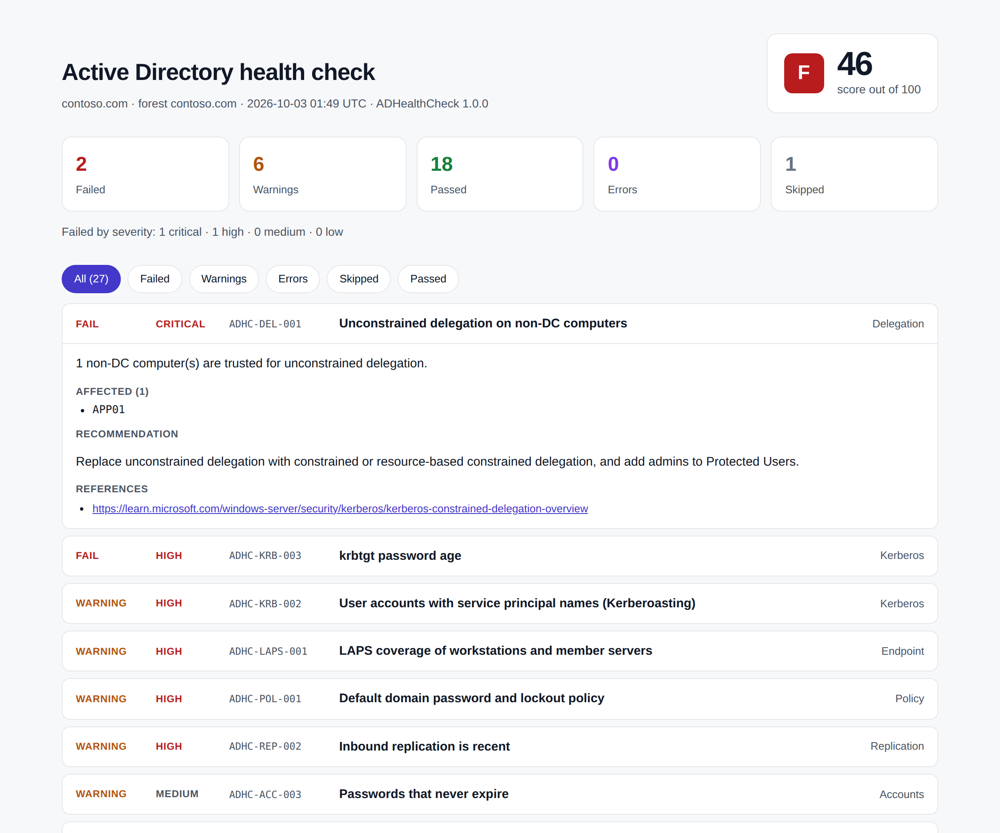

# ADHealthCheck

[](https://github.com/s3nafps/ADHealthCheck-PowerShell/actions/workflows/ci.yml)


[](LICENSE)

A PowerShell module that audits an Active Directory domain for **health and security
problems** and produces a scored, self-contained **HTML report** plus **JSON** for
automation.

It grew out of a weekly manual health check that took about three hours. Automated,
the same check runs in minutes and produces the same result every time.



*[Open the sample report](https://htmlpreview.github.io/?https://github.com/s3nafps/ADHealthCheck-PowerShell/blob/main/docs/sample-report.html), generated from the test fixture.*

## What it checks

27 rules across 10 areas. Full details in **[docs/rules.md](docs/rules.md)**.

| Area | Examples |
|---|---|
| Infrastructure | FSMO holders exist, DC OS support, DC/GC redundancy, service ports, functional level, Recycle Bin |
| Replication | Active failures, links that have not replicated recently |
| DNS | Every DC registered in the `_ldap._tcp.dc._msdcs` SRV record |
| Accounts | Stale users and computers, `PasswordNeverExpires`, `PasswordNotRequired`, reversible encryption, DES, built-in Administrator |
| Kerberos | AS-REP roastable accounts, Kerberoastable (privileged) accounts, krbtgt password age |
| Privileged access | Domain/Enterprise Admins size, Schema Admins empty, Protected Users / not-delegated, disabled or inactive admins |
| Delegation | Unconstrained delegation on non-DC computers |
| Policy | Default password and lockout policy |
| Group Policy | Unlinked GPOs, empty or fully disabled GPOs |
| Endpoint | Windows LAPS / legacy LAPS coverage |

Every finding comes with a severity, the affected objects, a recommendation and a
reference link.

## Quick start

Run from a domain-joined admin workstation with RSAT, or on a domain controller.

```powershell
# Install from a release, or clone and import directly
git clone https://github.com/s3nafps/ADHealthCheck-PowerShell.git
Import-Module ./ADHealthCheck-PowerShell/src/ADHealthCheck/ADHealthCheck.psd1

# Audit the current domain and write HTML + JSON reports
Invoke-ADHealthCheck -OutputPath C:\Reports
```

```text
Domain   : contoso.com
Summary  : @{Score=82; Grade=B; Total=27; Pass=21; Warning=4; Fail=2; Error=0; Skipped=0; ...}
Results  : {ADHC-ACC-001, ADHC-ACC-002, ...}
ReportFiles : {C:\Reports\ADHealthCheck_contoso.com_20261003-060012.json, ...html}
```

### More examples

```powershell
# Only what needs attention
$report = Invoke-ADHealthCheck -SkipNetworkCheck
$report.Results | Where-Object Status -in 'Fail', 'Warning' |
    Sort-Object Severity | Format-Table Id, Severity, Status, Message -Wrap

# Target one DC with alternate credentials, two categories only
Invoke-ADHealthCheck -Server dc01.contoso.com -Credential (Get-Credential) -Category Kerberos, 'Privileged Access'

# Stricter thresholds
Invoke-ADHealthCheck -Settings @{ StaleUserDays = 60; MaxDomainAdmins = 3 }
Invoke-ADHealthCheck -ConfigurationPath .\examples\settings.example.psd1

# Collect once, evaluate many times (or on another machine)
$context = Get-ADHealthCheckContext
Invoke-ADHealthCheckRule -Context $context -Id 'ADHC-KRB-*'

# List the rules without touching AD
Get-ADHealthCheckDefinition | Format-Table Id, Severity, Title
```

Ready-made scripts in [`examples/`](examples):

- **`Invoke-WeeklyHealthCheck.ps1`**: for a scheduled task. It writes reports, prunes
  old ones, and exits non-zero on failures at or above a chosen severity, so monitoring
  can alert.
- **`Compare-HealthCheckRun.ps1`**: diffs two JSON reports to show what got better or worse.

## Requirements

| | |
|---|---|
| PowerShell | Windows PowerShell 5.1 or PowerShell 7.x |
| Modules | `ActiveDirectory` (RSAT). `GroupPolicy` is optional; without it the GPO rules are skipped |
| Permissions | Any authenticated domain user can run most rules. Replication metadata and some attributes read best as a member of a read-only audit group or Domain Admins |
| Network | TCP to DCs on 53, 88, 135, 389, 445, 636, 3268 for the port rule. Use `-SkipNetworkCheck` from restricted hosts |

The module only **reads** from AD. It makes no changes.

## How it works

```text
Get-ADHealthCheckContext       Invoke-ADHealthCheckRule        Export-ADHealthCheckReport
 (collectors, AD queries)  -->  (27 declarative rules)    -->   (HTML + JSON)
         |                              |
   errors per collector         Pass / Warning / Fail / Error / Skipped
                                        |
                                 Get-ADHCScore -> 0-100, A-F
```

- **Collectors** query AD once and normalize the results. If one fails (for example
  replication metadata is access-denied), it is recorded and only the rules that
  depend on it report `Error`. The rest of the run continues.
- **Rules** are data files in [`src/ADHealthCheck/Checks`](src/ADHealthCheck/Checks).
  Each declares the data it needs and a `Test` scriptblock that only reads the
  collected context. That keeps rules side-effect free and lets the whole suite be
  unit-tested without a domain.
- **Scoring**: each failed rule subtracts its severity weight (Critical 20, High 10,
  Medium 5, Low 2), and a warning subtracts half.
- **Reports**: the HTML is a single file with no external CSS, fonts or scripts, so it
  opens on air-gapped admin hosts and can be attached to a ticket. It follows the
  system light/dark theme. All values are HTML-encoded.

## Development

```powershell
./build.ps1                      # PSScriptAnalyzer + Pester (with coverage)
./build.ps1 -Task Docs           # regenerate docs/rules.md
./build.ps1 -Task Package        # stage the module in ./out for Publish-Module
```

- **Tests:** 200+ Pester tests run against an in-memory fixture of a healthy domain, mutated per case. AD cmdlets are mocked for the collector tests. Line coverage is about 95%.
- **CI:** every push runs on PowerShell 7 (Ubuntu and Windows) and Windows PowerShell 5.1. It also fails if `docs/rules.md` is out of date.
- **Release:** pushing a `vX.Y.Z` tag tests the module, builds a zip, creates a GitHub release, and publishes to the PowerShell Gallery when a `PSGALLERY_API_KEY` secret is set.

See [CONTRIBUTING.md](CONTRIBUTING.md) to add a rule.

## Roadmap

- Fine-grained password policies (PSOs) and their coverage
- AdminSDHolder ACL and dangerous ACE detection on the domain head
- Certificate Services templates (ESC1-ESC8 style misconfigurations)
- Trust inventory (SID filtering, selective authentication)

## License

[MIT](LICENSE) (c) Mohamed Senator
